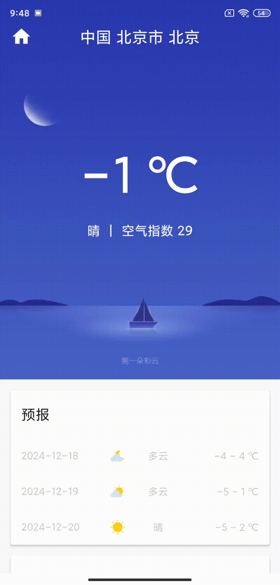
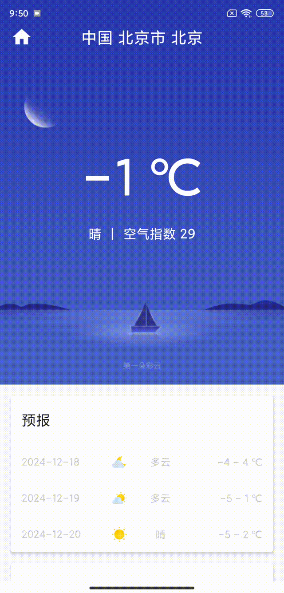

# 晴川天气（SunnyWeather）

## 简介：

**晴川天气**是一款基于MVVM框架的Android天气预报软件，具备查询全球各省市县天气、自由切换城市、手动更新天气等功能。
**晴川天气**中的天气数据由[**彩云天气**](https://caiyunai.com/api/weather_api.html)提供，
背景图片由__《第一行代码Android（第3版）》__提供，
代码遵循Apache v2 License开源协议。**本软件主要作为学习和交流使用。**

## 屏幕截图

 

 

## 许可

> Copyright (C) liuhaiyang, Ganzhou Quxiang Inc. Open source codes for study only.
> Do not use for commercial purpose.
>
> Licensed under the Apache License, Version 2.0 (the "License");
> you may not use this file except in compliance with the License.
> You may obtain a copy of the License at
>
> http://www.apache.org/licenses/LICENSE-2.0
>
> Unless required by applicable law or agreed to in writing, software
> distributed under the License is distributed on an "AS IS" BASIS,
> WITHOUT WARRANTIES OR CONDITIONS OF ANY KIND, either express or implied.
> See the License for the specific language governing permissions and
> limitations under the License.